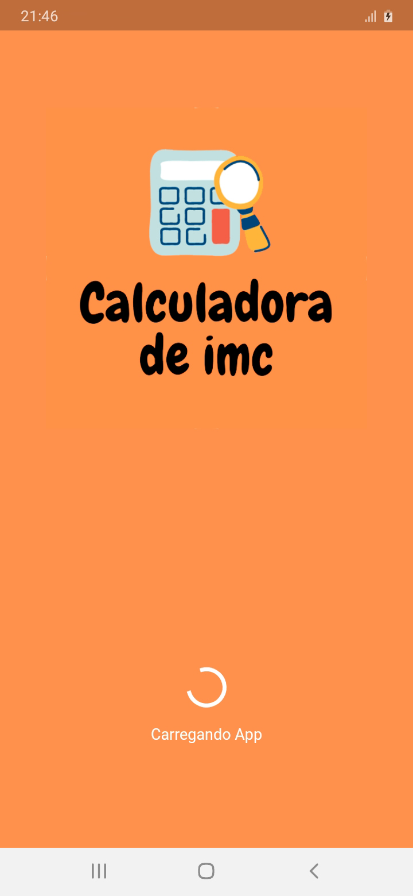
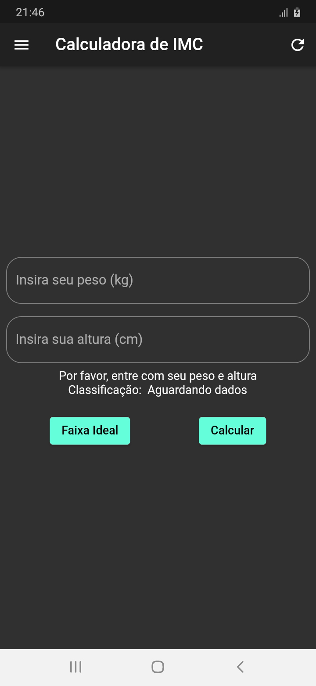
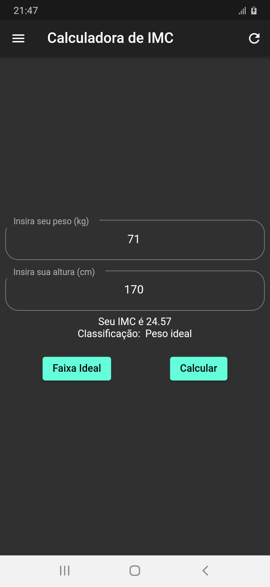
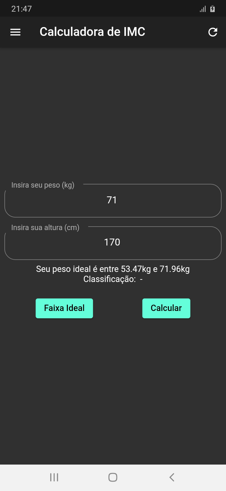
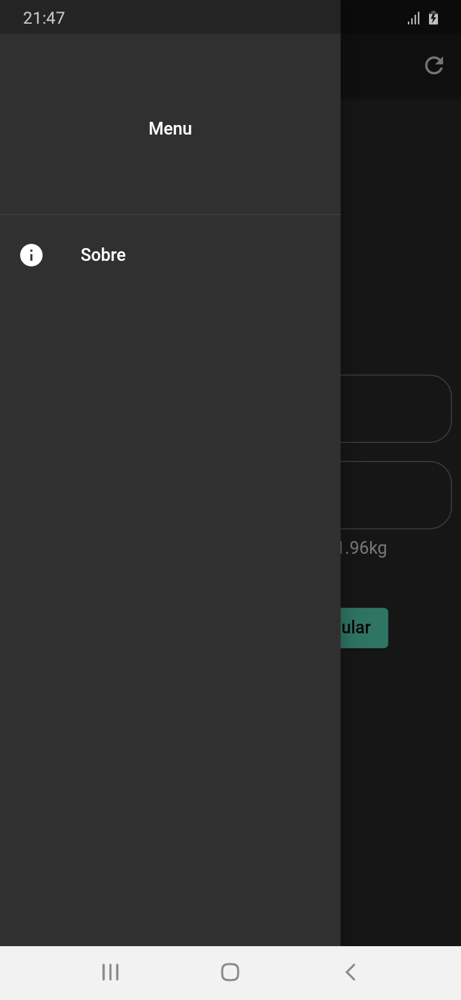
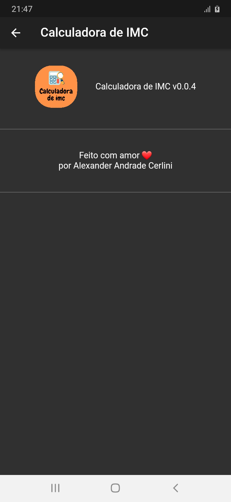

# bmi_calculator

 

A Dart & Flutter app that calculates Body Mass Index

<h4 align="center"> 
	🚧  BMI Calculator 🚀 In Production on Play Store  🚧
</h4>

---

## Features

- [x] Receive data from user and return BMI index.
- [x] Return too BMI classification
- [x] Ideal weight range button working

---

## App Preview

---

### Pre-requisites

- Install [Flutter SDK](https://flutter.dev/docs/get-started/install).
- Setup your [favorite code editor](https://flutter.dev/docs/get-started/editor) (I recommend using [VS Code](https://code.visualstudio.com/))

---

## Technology

- Dart
- Flutter

---

## Author

---

<a href="https://github.com/alex-cerlini">
 
  
 <b>Alexander Andrade Cerlini</b></a> <a href="https://github.com/alex-cerlini" title="Alex Cerlini">🚀</a>

Feito com ♥.

